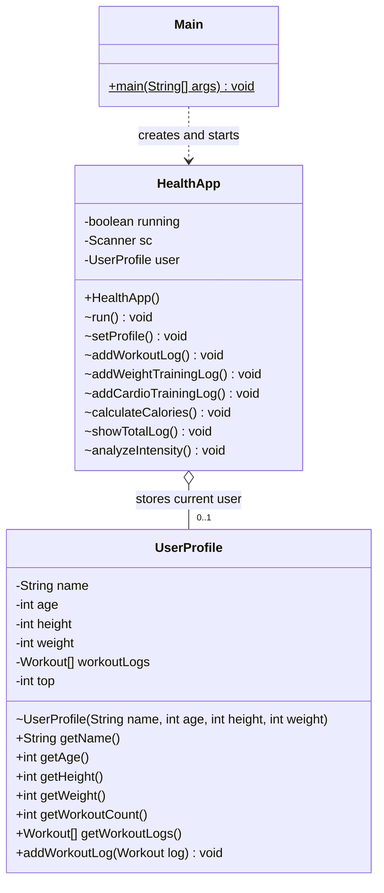

# HealthApp, Main, UserProfile 클래스 UML

발표용으로 `Main`, `HealthApp`, `UserProfile` 세 클래스의 역할과 관계만 나타낸 클래스 다이어그램이다. 프로그램 실행 순서를 나타내는 흐름도가 아니라, 클래스가 가진 속성/메서드와 객체 간 관계를 표현한다.

## 관계 설명

| 관계 | 의미 |
|---|---|
| `Main ..> HealthApp` | `Main`의 `main()` 메서드가 `HealthApp` 객체를 생성하고 실행한다. |
| `HealthApp o-- UserProfile` | `HealthApp`이 현재 사용자의 프로필 객체를 필드로 보유한다. 프로필 설정 전에는 객체가 없을 수 있으므로 `0..1`로 표시한다. |

## PPT 배치 시 설명 문장

> 이 다이어그램은 실행 순서를 표현한 흐름도가 아니라, 프로그램 실행을 시작하는 `Main`, 메뉴와 기능을 담당하는 `HealthApp`, 사용자 정보와 운동 기록을 저장하는 `UserProfile`의 클래스 구조 및 관계를 나타낸 것입니다.

