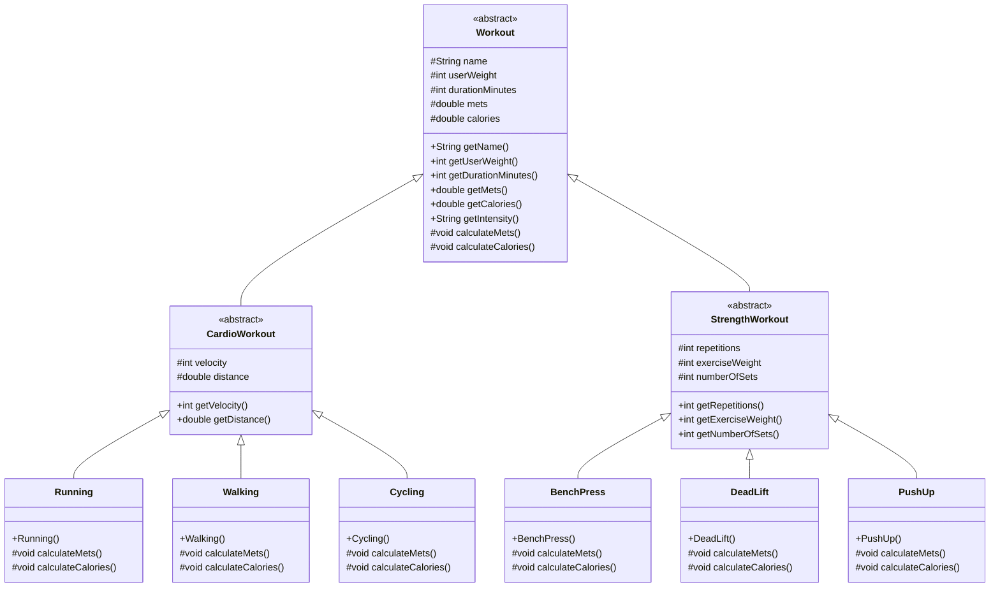

```mermaid
classDiagram
    class Workout {
        <<abstract>>
        #String name
        #int userWeight
        #int durationMinutes
        #double mets
        #double calories
        +String getName()
        +int getUserWeight()
        +int getDurationMinutes()
        +double getMets()
        +double getCalories()
        +String getIntensity()
        #void calculateMets()
        #void calculateCalories()
    }

    class CardioWorkout {
        <<abstract>>
        #int velocity
        #double distance
        +int getVelocity()
        +double getDistance()
    }

    class StrengthWorkout {
        <<abstract>>
        #int repetitions
        #int exerciseWeight
        #int numberOfSets
        +int getRepetitions()
        +int getExerciseWeight()
        +int getNumberOfSets()
    }

    class Running {
        +Running()
        #void calculateMets()
        #void calculateCalories()
    }

    class Walking {
        +Walking()
        #void calculateMets()
        #void calculateCalories()
    }

    class Cycling {
        +Cycling()
        #void calculateMets()
        #void calculateCalories()
    }

    class BenchPress {
        +BenchPress()
        #void calculateMets()
        #void calculateCalories()
    }

    class DeadLift {
        +DeadLift()
        #void calculateMets()
        #void calculateCalories()
    }

    class PushUp {
        +PushUp()
        #void calculateMets()
        #void calculateCalories()
    }

    Workout <|-- CardioWorkout
    Workout <|-- StrengthWorkout

    CardioWorkout <|-- Running
    CardioWorkout <|-- Walking
    CardioWorkout <|-- Cycling

    StrengthWorkout <|-- BenchPress
    StrengthWorkout <|-- DeadLift
    StrengthWorkout <|-- PushUp
```